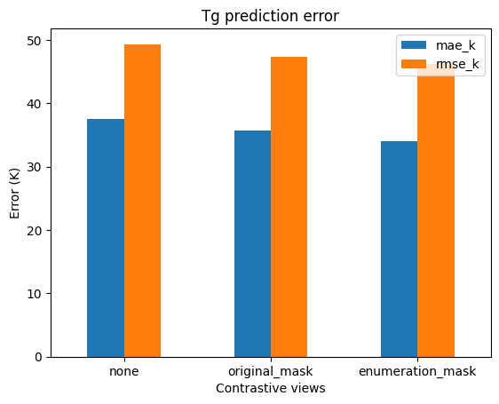
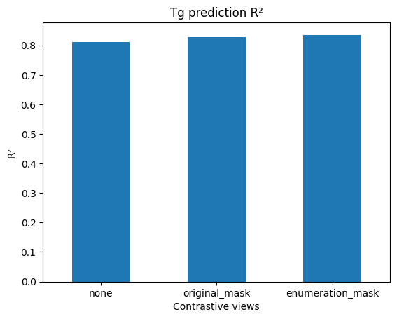
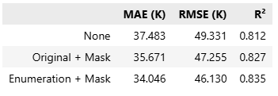

# Contrastive Polymer Representation Learning for Tg Prediction

This project explores whether contrastive pretraining can improve polymer representations for **glass transition temperature (Tg) prediction**. It compares three ways of constructing contrastive views with a polyBERT encoder, adapting the augmentation ideas from the **PolyCL** paper.

The experiments use **7,372 polymer samples** and evaluate how masking and SMILES enumeration affect downstream Tg prediction.

## Approach

Three contrastive pretraining settings are compared:

| Contrastive views | View 1 | View 2 |
|---|---|---|
| **None** | Original | Original |
| **Original + Mask** | Original | 10% token masking |
| **Enumeration + Mask** | Enumerated SMILES | 10% token masking |

Pretraining uses:

- **polyBERT** as the polymer encoder
- **NT-Xent loss** for contrastive learning
- **10% token masking**
- **RDKit** for non-canonical SMILES enumeration
- the **[CLS] token representation** as the polymer-level embedding

For the downstream task, the pretrained encoder is frozen and its `[CLS]` representation is used to train a Tg regression head. The current split uses **5,898 training samples** and **1,474 test samples** (80/20).

## Results

Adding explicit augmentations improved Tg prediction over the no-augmentation baseline.

| Pretraining | MAE (K) | RMSE (K) | R² | MAE improvement vs. baseline |
|---|---:|---:|---:|---:|
| None | 37.483 | 49.331 | 0.812 | — |
| Original + Mask | 35.671 | 47.255 | 0.827 | **4.83%** |
| Enumeration + Mask | **34.046** | **46.130** | **0.835** | **9.17%** |

The **Enumeration + Mask** model reduced MAE by **9.17%** and RMSE by **6.49%** compared with the no-augmentation baseline, while increasing R² from **0.812 to 0.835**.

### Tg prediction error



### R² comparison



### Result summary




## Running the project

Install the dependencies:

```bash
pip install -r requirements.txt
```

Pretrain each contrastive setting:

```bash
python pretrain.py none
python pretrain.py original_mask
python pretrain.py enumeration_mask
```

This creates separate checkpoints under `checkpoints/`.

Run the downstream Tg task with a pretrained checkpoint:

```bash
python train_tg.py checkpoints/polycl_enumeration_mask.pt
```

The full workflow, including the three pretraining strategies, downstream evaluation, result table and plots, is also shown in `demo.ipynb`.


## Reference

The contrastive augmentation setup was adapted from:

**Zhou et al. — _PolyCL: contrastive learning for polymer representation learning via explicit and implicit augmentations_**, Digital Discovery.

https://doi.org/10.1039/D4DD00236A
